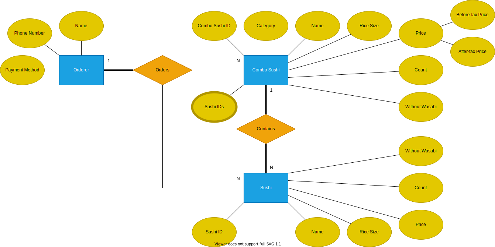

# 課題１〜３

## 課題１

DB スキーマの設計を、下記のテーブルとカラムにまとめた。

### DB スキーマ

エンティティ

- セットメニュー（詰め合わせ）： ComboSushi
- お好みすし（単品）： Sushi
- 注文者： Orderer

アトリビュート

- 種類：category
- ネタの名前：name
- 値段：price
- 個数・皿数：count
- ぬき：Without wasabi

モデル

各エンティティの DB スキーマのモデルを prisma 形式で載せた。

```prisma
enum Category {
  Morikomi
  Nigiri
  Don
  Jimoto
}

model ComboSushi {
  id            String   @id @default(uuid())
  createdAt     DateTime @default(now())
  updatedAt     DateTime @updatedAt
  name          String
  category      Category
  price         Int
  count         Int
  withoutWasabi Boolean
}

model Sushi {
  id            String   @id @default(uuid())
  createdAt     DateTime @default(now())
  updatedAt     DateTime @updatedAt
  name          String
  price         Int
  count         Int
  withoutWasabi Boolean
}

model Orderer {
  createdAt   DateTime @default(now())
  updatedAt   DateTime @updatedAt
  name        String
  phoneNumber Int      @unique
  paid        Boolean
}
```

ER 図的なもの


ER 図の表記について

- 長方形：Entities
- 楕円：Simple Attributes
  - 太めのボーダー付き：Multivalued Attributes
- ひし形：Relationships
- 細線：Partial participation
- 太線：Total participation
- 1, N：カーディナリティ

### 任意課題

TODO: あとでやる

#### 概念モデル

#### 論理モデル

#### 物理モデル

---

## 課題２

仕様変更への対応を行い、ER 図に反映した。

### シャリの大小も選べるようにする

Combo Sushi テーブル、Sushi テーブルに、シャリの大小の属性を追加する。

選択肢が 2 つであることと、Boolean よりコンテキストに合う（今後シャリのサイズのバリエーションが増える場合などにも対応できる）ことから、Enum が適切だと考える。

モデル

```prisma
enum Category {
  Morikomi
  Nigiri
  Don
  Jimoto
}

enum ShariSize {
  Large
  Small
}

model ComboSushi {
  id            String    @id @default(uuid())
  createdAt     DateTime  @default(now())
  updatedAt     DateTime  @updatedAt
  name          String
  category      Category
  price         Int
  count         Int
  withoutWasabi Boolean
  shariSize     ShariSize
}

model Sushi {
  id            String   @id @default(uuid())
  createdAt     DateTime @default(now())
  updatedAt     DateTime @updatedAt
  name          String
  price         Int
  count         Int
  withoutWasabi Boolean
}

model Orderer {
  createdAt   DateTime @default(now())
  updatedAt   DateTime @updatedAt
  name        String
  phoneNumber Int      @unique
  paid        Boolean
}
```

### 寿司ネタが毎月何個売れているのかを知れるようにする

Combo Sushi テーブルに、Sushi テーブル内のネタ ID からなる配列の属性として加えることで、Combo Sushi の販売個数の内訳の、各ネタの販売数量も知ることができるので、全体での集計も可能となると考える。この場合の加える属性は、他が Simple attributes なことに対して、 Multivalued attributes に分類できる。

モデル

```prisma
enum Category {
  Morikomi
  Nigiri
  Don
  Jimoto
}

enum ShariSize {
  Large
  Small
}

model ComboSushi {
  id            String    @id @default(uuid())
  sushiId       String[]
  createdAt     DateTime  @default(now())
  updatedAt     DateTime  @updatedAt
  name          String
  category      Category
  price         Int
  count         Int
  withoutWasabi Boolean
  shariSize     ShariSize
}

model Sushi {
  id            String       @id @default(uuid())
  createdAt     DateTime     @default(now())
  updatedAt     DateTime     @updatedAt
  name          String
  category      Category
  price         Int
  count         Int
  withoutWasabi Boolean
}

model Orderer {
  createdAt   DateTime @default(now())
  updatedAt   DateTime @updatedAt
  name        String
  phoneNumber Int      @unique
  paid        Boolean
}
```

ER 図的なもの


ただ、Multivalued attributes が使えない場合には、そもそもの ComboSushi エンティティはなくして、Sushi エンティティに、カテゴリを加えることで、集計を可能にできそうだが、大掛かりな DB のマイグレが必要になると思われる。

モデル

```prisma
enum Category {
  None
  Morikomi
  Nigiri
  Don
  Jimoto
}

enum ShariSize {
  Large
  Small
}

model Sushi {
  id            String   @id @default(uuid())
  createdAt     DateTime @default(now())
  updatedAt     DateTime @updatedAt
  name          String
  category      Category
  price         Int
  count         Int
  withoutWasabi Boolean
}

model Orderer {
  createdAt   DateTime @default(now())
  updatedAt   DateTime @updatedAt
  name        String
  phoneNumber Int      @unique
  paid        Boolean
}
```

---

## 課題３

### 考えうる追加仕様

- 表示価格を、税込・税抜のどちらかを一斉選択できるように
  - 後方互換性考慮した場合、After-tax Price を attribute に追加する
  - 後方互換性考慮しなくてもよい場合、Price を Simple attribute から Composite attribute にする
- お支払い方法の追加で、クレカや電子マネー決済が選択できるように
  - 後方互換性考慮した場合、Paid を残して、PaymentMethod の Enum にして、None, CreditCard, EMoney と選べるようにする
  - 後方互換性考慮しなくてもよい場合、Paid を PaymentMethod に置き換える

ER 図的なもの



---

## Note

### Database schema

A schema is the blueprint of a database.

- Names of tables
- Columns of each table
- Datatype
- Functions
- Other objects

are included in the schema.

We use the schema diagram to display the schema of a database.
