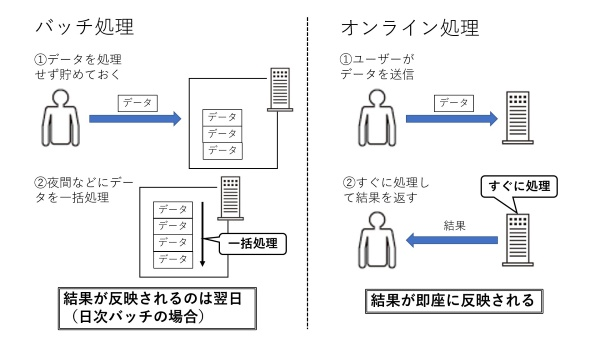

# DB モデリング４

## 課題１

- ユーザー ID は、[メンバー ID](https://help.receptionist.jp/?p=1100) と同じ
- リマインダーは作成のみで、更新はできず、削除はできる
- リマインダー削除後に再度参照することはないと判断し、物理削除
- リマインダーのタスクを完了にした時も、再度参照することはないと考え、物理削除
- リマインダー次回送信日時は、バッチ処理（cron job?）のタイミングで、更新の条件に合う場合に更新をかける

[](https://mermaid.live/edit#pako:eNqdk89OwjAcx1-l6Zm9ADcjMxIRDeitCalbwSWsw64zMWjCWIx40osSRY0Y9eAfLhpNFOPD1M5w8hVsmALquHhZlvbz_fbX73erQsMxCUxCwlIWLjFsI4poPjMxOaMt5vUcWF_XNKcKcvpsOpvSc9pwS8vpmYmF9Fw2P52eB0mwRMoOLbkF7iD6jf9T_mOCKqIAGMuYAcsE8zMAQRFciqAr6g_qmU4hiOjGyJFx_JUITkT9XAR3IqgNVACsYtYnbeK6uERi2XB_q3d8FvF9uMjIikeosRaL92r-22u7d_osny4_ug2DOVS-nMnujvA7svUkO4e9vUflKW-bstH86G5HztxSM3BsV4DBCObELGAe6__2chQ2dsPmRXhQ_y1lxLboWGV405atk2i-oX4kurHtDCONTiCsoLKd-t2F8K_f73eFfyH8nfGZj_iosgueO-IWDSc3Gyqsvy3_1BaZY8erg1i1uihMQJswG1um-uL7l0KQLxObIJhUryYpYq_M-7BCvYqpitBNizsMJou47JIExB538mvUGCxE1NfP87W68QkW0XvX)

### バッチ実行時の次回送信日時の更新

## バッチ処理について調べたこと

### バッチ処理とは？

どこかのタイミングでまとめて実施される処理。すぐやらなくても大丈夫そうな処理を溜めておいて、どこかのタイミングでまとめてやる。

バッチ処理とは、プログラム（データ）を処理目的ごとにまとめ、そのデータを順次処理していく一連の流れ、システムを指す。

バッチ処理では、ユーザーはデータを収集して保存し、「バッチウィンドウ」と呼ばれるイベント中にデータを処理する。処理の優先順位を設定し、最も理にかなったタイミングでデータジョブを完了することにより、効率が向上する。

### バッチ処理とオンライン処理

（<https://xtech.nikkei.com/atcl/nxt/column/18/01854/111100001/> から引用）

### バッチ処理のやり方

企業や組織が大量のデータを効率的に管理するうえで、バッチ処理は重要な役割を果たす。特に、会計プロセスなどの頻繁に発生する繰り返しの多いタスクの処理に適している。あらゆる業界や仕事においても、バッチ処理の基本的なやり方は同じ。重要なパラメーターは次のとおり。

1. ジョブを送信するユーザー
2. 実行されるプログラム
3. 入力と出力の場所
4. ジョブを実行すべき時刻

つまり、「誰が、何を、どこで、何のために」実行するのか、ということ。

### バッチ処理が使われる一例

例えば、請求処理の自動化で、

- 買い物をした数日後に、銀行口座にクレカの取引が表示される、一連のトランザクション：
  - 買い物の後、しばらくしてからバッチ処理がされている
- ある企業が、月に一度顧客に請求し、従業員には 2 週間ごとに給与を支払う
  - 月 1 回の請求サイクル・2 週間に 1 回の給与支払いサイクルも、バッチ処理が行われている

### バッチ処理のメリット

- ジョブの効率化
- データ入力の簡素化
- データクオリティの向上
